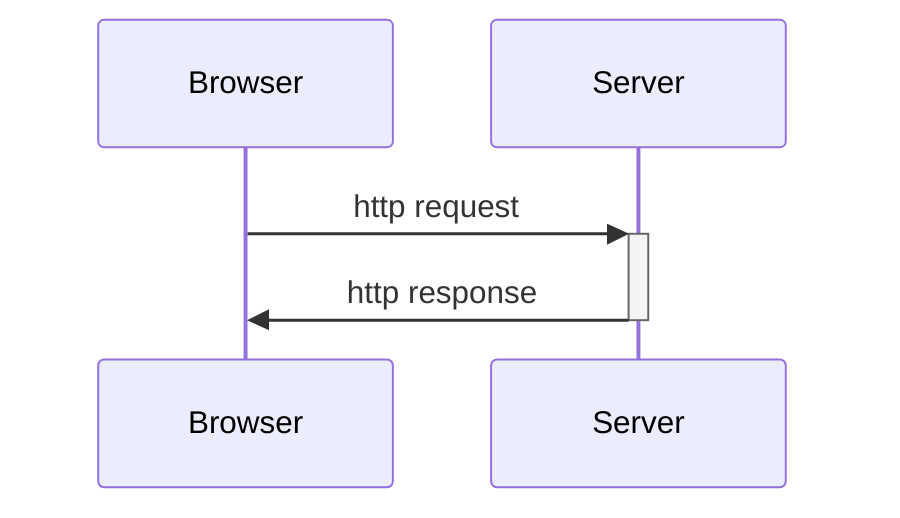
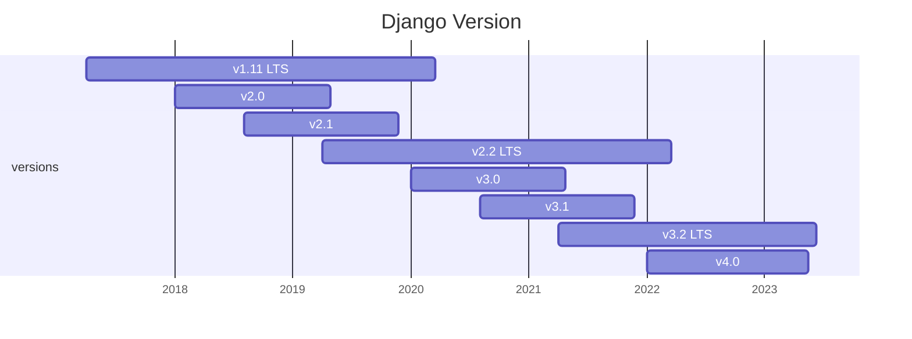
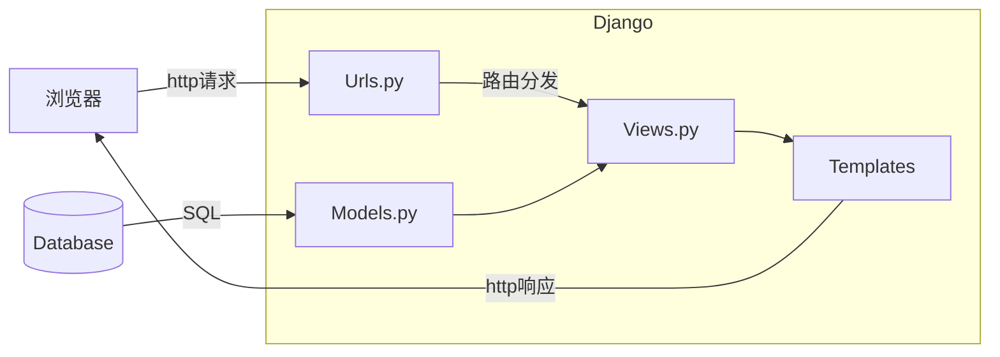

# Django入门

## 1. 前言

应用程序（Application）的发展是为了帮助解决人们在使用计算机过程中遇到的实际问题，或者说是一种完成任务的工具。从命令行应用到可视化的图形应用，从本地运行的桌面应用到浏览器运行的Web应用，从计算机应用到手机移动端的应用等等，尽管它们的表现形式和实现方法千差万别，但是其本质上都是属于人类**处理数字化任务的工具**。

从互联网诞生至今，Web应用作为流行的工具之一深受网络用户的喜爱和追捧。Web应用是基于http协议开发的一种程序，在本质上是基于浏览器和服务器之间的http请求和http响应。

> 1. 浏览器客户端发送http请求到服务器，包含请求信息
> 2. 服务器接收并解析http请求，进行逻辑处理和运算
> 3. 服务器将处理结果包装为http响应，再发送给浏览器




Web应用通常包括前端页面（即浏览器展示的html/css/javascript等元素）和后端程序（处理业务逻辑和数据交换）。在早期的开发过程中，前后端概念比较模糊，用于展示内容的静态文件和处理逻辑的代码都放在同一个工程中进行编写，这时候大多数的浏览器访问的都是一个静态页面，交互比较生硬，数据的传输不够流畅。但随着Ajax技术的兴起，前后端工程逐渐被分离，前端负责数据展示和动态交互，后端负责建立数据模型和逻辑处理，前后段通过Ajax请求来实现通信，这种方式极大地提高了Web应用的开发效率，更增加了代码的可维护性。

> **Ajax**即Asynchronous Javascript And XML（异步JavaScript和XML），它不是一种新的编程语言，而是一种用于创建更好更快以及交互性更强的Web应用程序的技术。

## 2. Django简介

Django是python环境下的一个开源Web框架，用于快速搭建web应用程序，最初被设计用于具有快速开发需求的新闻类站点，目的是要实现简单快捷的网站开发，它是基于MVT的开发模式，适用于构建复杂的大型Web应用。

[Django官网](https://www.djangoproject.com/) [Django文档](https://docs.djangoproject.com/en/4.2/)



### 2.1 Django安装

1. Python环境

   首先需要确认计算机上已经配置了正确的python环境，通常情况下单独安装python会在全局设置环境变量（windows），打开CMD，输入python确认：

   ```
   C:\Users\22160>python
   Python 3.10.9 | packaged by Anaconda, Inc. | (main, Mar  1 2023, 18:18:15) [MSC v.1916 64 bit (AMD64)] on win32
   Type "help", "copyright", "credits" or "license" for more information.
   >>>
   ```

   而通过Anaconda安装的python则建议创建单独的虚拟环境：

   ```
   conda create -n django python=3.10.9
   ```

2. 数据库依赖

   Django默认使用SQLite数据库，这是一种文件形式的轻量型的数据库。而对于复杂的大型项目，需要功能更丰富的数据库引擎，例如PostgreSQL、MariaDB、MySQL 或者 Oracle。

3. 安装Django

   激活进入python虚拟环境中，输入以下命令安装正式版Django：

   ```
   pip install django
   ```

### 2.2 Django项目架构

1. 创建项目

   新建项目文件夹django-test，并在当前目录打开命令行，输入命令：

   ```
   django-admin startproject project_01
   ```

   进入project_01文件夹，包含以下文件结构：

   ```
   project_01/				(项目根目录)
   │  db.sqlite3			(SQLite3数据库文件)
   │  manage.py			(Django命令行工具)
   └─ project_01/			(python包)
      │  asgi.py			(ASGI服务器入口文件)
      │  settings.py		(配置文件)
      │  urls.py			(URL路由配置)
      │  wsgi.py			(WSGI服务器入口文件)
      └─ __init__.py		(包初始化文件)
   ```

2. 创建应用

   Django的项目被定义为多个应用的集合，用来共同完成某一项任务。创建一个应用news，输入命令：

   ```
   python manage.py startapp news
   ```

   创建的news也是一个python包，文件结构如下：

   ```
   news/					(应用根目录)
   │  admin.py				(admin后台管理)
   │  apps.py				(应用配置)
   │  models.py			(模型文件)
   │  tests.py				(测试文件)
   │  urls.py				(URL路由配置)		
   │  views.py				(视图文件)
   │  __init__.py			(包初始化文件)
   └─ migrations/			(数据库迁移文件夹)
      └─  __init__.py		(包初始化文件)
   ```

3. 运行项目

   在开发过程中，运行以下命令即可在本地运行一个开发服务器：

   ```
   python manage.py runserver
   ```

   通过访问 http://127.0.0.1:8000/ 就可以看到首页。更换IP和端口可以在runserver命令后输入：

    ```
   python manage.py runserver 8080
    ```
   
   当项目代码发生改变，服务器会刷新重启，载入新的代码。

### 2.3 Django的开发模式

Django采用MVT的设计模式，对应应用下的文件（models.py），视图（views.py），模板（templates，暂未创建）。MVT设计模式衍生自MVC，这种设计模式增强了代码的可扩展性和可移植性，其目的是使代码解耦。

> - M-Model（模型）
>    负责和数据库进行交互
> - V-View（视图）
>    负责向用户展示数据
> -  T-Template（模板）
>    负责根据数据构造想要的html页面

如下图所示：




整个流程，路由（urls.py）会将不同的请求路径定位到不同的视图函数，视图函数则会根据定义好的数据模型在数据库中获取数据，处理业务逻辑，并将返回数据发送到模板中，由模板创建相应的html，最后返回到浏览器。

## 3. 设计模型

Django的model定义在ORM之上，ORM是一种对数据库的抽象层，它将数据库表映射为类，将表字段映射为类变量，将记录映射为类的实例，因此可以通过定义模型类来快捷地对数据库进行增删改查等操作。

> 对象关系映射（Object Relational Mapping，简称ORM）模式是一种为了解决面向对象与关系数据库存在的互不匹配的现象的技术

### 3.1 数据库配置

Django默认使用轻量级的SQLite3数据库，除此之外官方还支持：

- PostgreSQL
- MariaDB
- MySQL
- Oracle

1. 首先确认本地开发环境已安装数据库，以MySQL为例，在正确配置MySQL后，在命令行输入`mysql --version`可以获得版本信息。

   ```
   C:\Users\22160>mysql --version
   mysql Ver 8.0.33 for Win64 on x86_64 (MySQL Community Server - GPL)
   ```

2. 安装MySQL驱动，即python环境下的MySQL模块，推荐使用[mysqlclient](https://pypi.org/project/mysqlclient/)，它是原生支持的驱动，是线程安全的，而且提供连接池。

   ```
   pip install mysqlclient
   ```

3. 修改项目文件夹中的配置文件settings.py，注释原有的SQLite3配置，添加新的**DATABASES**。

   ```python
   DATABASES = {
       'default': {
           'ENGINE': 'django.db.backend.mysql',    # 数据库引擎
           'HOST': '127.0.0.1',                    # 数据库主机
           'PORT': '3306',                         # 数据库端口
           'USER': 'root',                         # 用户名
           'PASSWORD': '*************',            # 密码
           'NAME': 'news',                         # 数据库名称
       }
   }
   ```

### 3.2 模型类定义

前述Django采用ORM框架来操纵数据库，首先我们需要进行数据库结构设计，在此基础上我们对表进行抽象，在应用的models.py中编写模型类。参考官方例子，在news中创建2个模型**Question**和**Choice**分别对应问题和答案选项。

```python
from django.db import models


class Question(models.Model):
    question_text = models.CharField(max_length=200)
    pub_date = models.DateTimeField("date published")
	
    # 魔法方法，用于打印显示
    def __str__(self) -> str:
        return self.question_text


class Choice(models.Model):
    question = models.ForeignKey(Question, on_delete=models.CASCADE)
    choice_text = models.CharField(max_length=200)
    votes = models.IntegerField(default=0)
	
    # 魔法方法，用于打印显示
    def __str__(self) -> str:
        return self.choice_text
```

这里首先导入模块models，所有编写的模型类都需要继承models.Model父类，用来享受ORM功能。在编写模型类过程中没有显示定义主键，而这在数据表是必须要存在的，Django会自动为每个模型设置自增的id作为主键。

- **Question**中定义2个字段：*question_text*设置为最大200字符的CharField，*pub_date*设置为DateTimeField并添加别名。
- **Choice**中定义3个字段：*question*为外键连接Question表并设置级联删除，*choice_text*设置为最大200字符的CharField，*votes*设置为IntegerField并拥有默认值0。

#### 3.2.1 字段

关于模型支持的常用字段，整理如下：

| 字段类型            | 说明                                                         |
| ------------------- | ------------------------------------------------------------ |
| `AutoField`         | 根据可用的 ID 自动递增的`IntegerField`，通常不需要直接使用，如果没有指定，主键字段会自动添加到模型中 |
| `BigAutoField`      | 一个 64 位整数，与 `AutoField`很相似，允许1 到 9223372036854775807 的数字 |
| `BigIntegerField`   | 一个 64 位的整数，和 `IntegerField` 很像，允许 -9223372036854775808 到 9223372036854775807 的数字 |
| `BooleanField`      | 一个 true/false 字段，当 *default*没有定义时，`BooleanField`的默认值是None |
| `CharField`         | 一个字符串字段，适用于小到大的字符串，参数*max_length*表示最大字符数 |
| `DateField`         | 一个日期，在 Python 中用一个 *datetime.date* 实例表示。<br />参数*auto_now*表示每次保存对象时，自动将该字段设置为现在<br />参数*auto_now_add*表示第一次创建对象时，自动将该字段设置为现在 |
| `DateTimeField`     | 一个日期和时间，在 Python 中用一个 *datetime.datetime* 实例表示，与 `DateField` 一样使用相同的额外参数 |
| `DecimalField`      | 一个固定精度的十进制数，在 Python 中用一个 *Decimal* 实例来表示。<br />参数*max_digits*表示允许的最大位数，这个数字必须大于或等于 *decimal_places*<br />参数*decimal_places*表示小数位数 |
| `DurationField`     | 一个用于存储时间段的字段，在 Python 中用一个 *timedelta* 实例表示 |
| `EmailField`        | 一个 `CharField`，使用 EmailValidator 来检查该值是否为有效的电子邮件地址 |
| `FileField`         | 一个文件上传字段，参数*upload_to*指定上传目录                |
| `FilePathField`     | 一个 `CharField`，其选择仅限于文件系统中某个目录下的文件名，参数*path*指定绝对路径 |
| `FloatField`        | 在 Python 中用一个 *float* 实例表示的浮点数                  |
| `ImageField`        | 一个图片上传字段，继承 `FileField` 的所有属性和方法          |
| `IntegerField`      | 一个整数，从 -2147483648 到 2147483647 的值                  |
| `SmallAutoField`    | 类似`AutoField`，允许1 到 32767 的值                         |
| `SmallIntegerField` | 类似`IntegerField`，允许-32768 到 32767 的值                 |
| `TextField`         | 一个大的文本字段                                             |
| `TimeField`         | 一个时间，在 Python 中用 *datetime.time* 实例表示。接受与 `DateField` 相同的自动填充选项 |

除了类型字段外，还有表示对应关系的字段：

1. `ForeignKey`——表示多对一关系
2. `ManyToManyField`——表示多对多关系
3. `OneToOneField`——表示一对一关系

## 4. 规划路由

## 5. 编写视图

## 6. 构建模板

