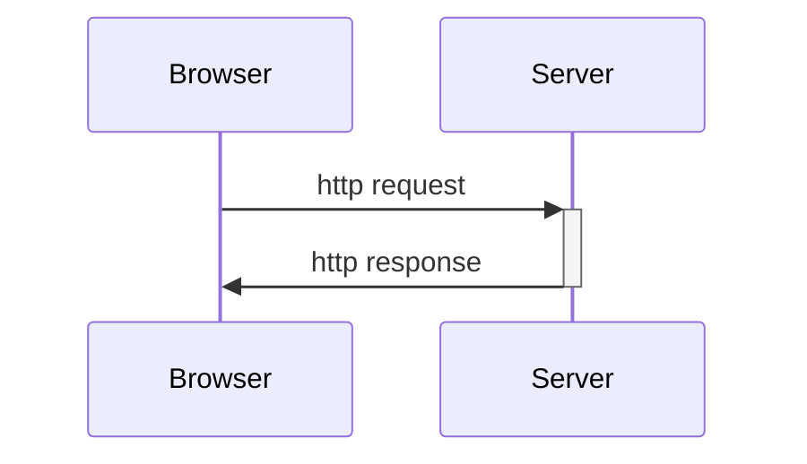
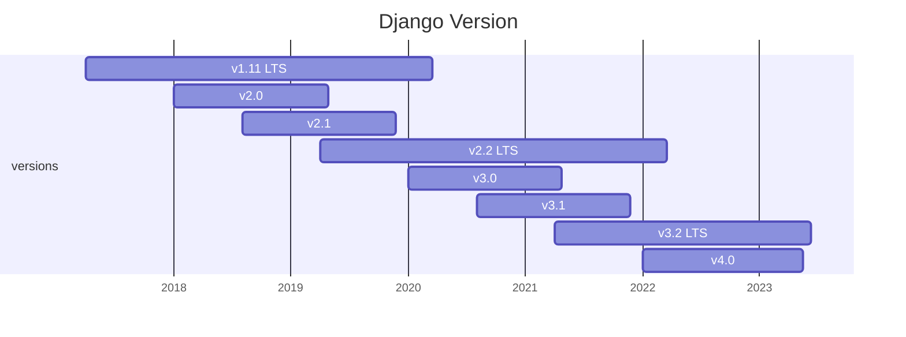
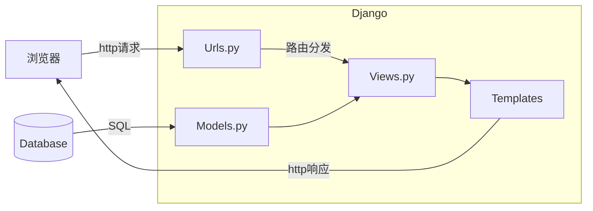
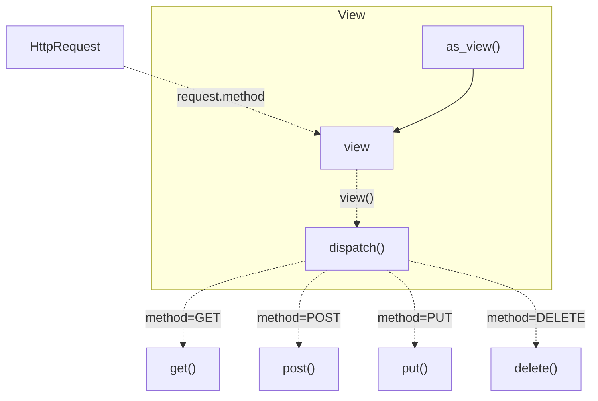
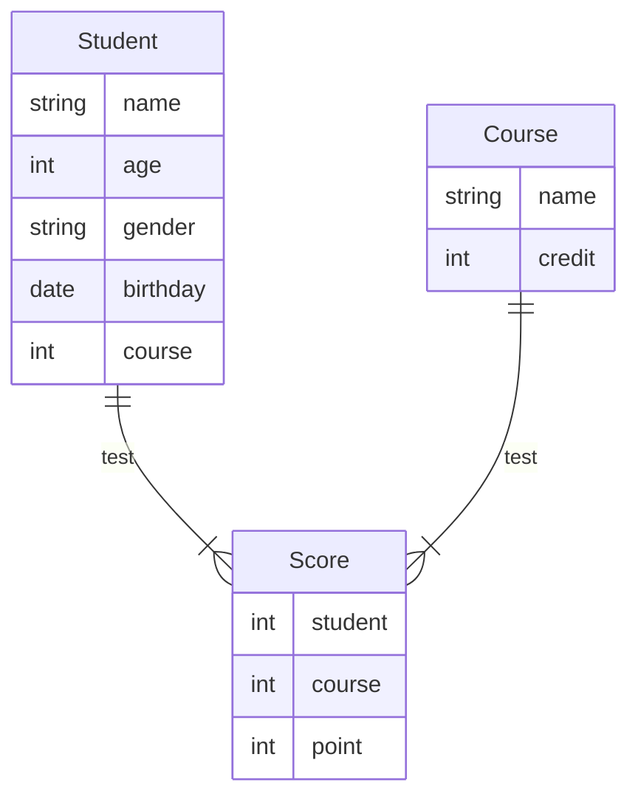
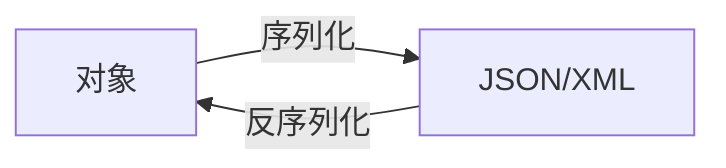
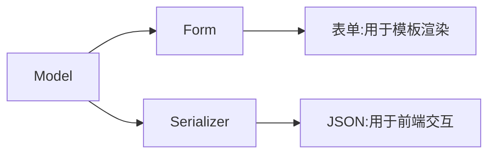
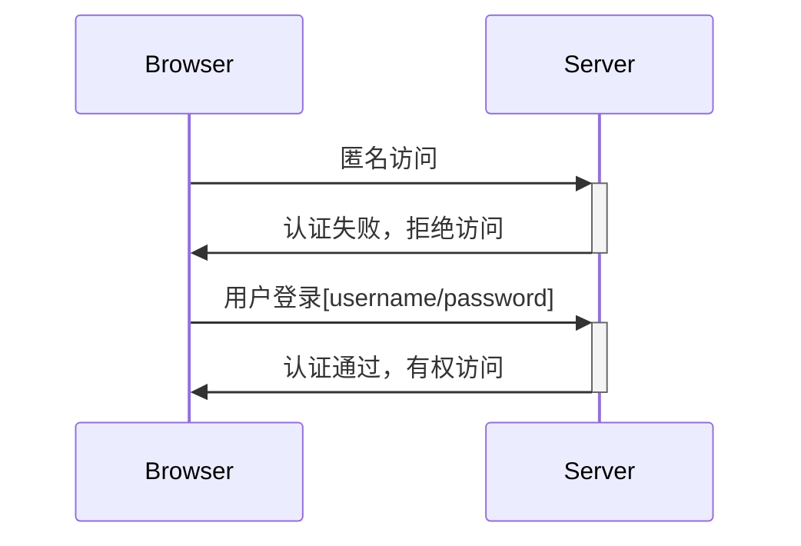

# Django入门

## 1. 前言

应用程序（Application）的发展是为了帮助解决人们在使用计算机过程中遇到的实际问题，或者说是一种完成任务的工具。从命令行应用到可视化的图形应用，从本地运行的桌面应用到浏览器运行的Web应用，从计算机应用到手机移动端的应用等等，尽管它们的表现形式和实现方法千差万别，但是其本质上都是属于人类**处理数字化任务的工具**。

从互联网诞生至今，Web应用作为流行的工具之一深受网络用户的喜爱和追捧。Web应用是基于http协议开发的一种程序，在本质上是基于浏览器和服务器之间的http请求和http响应。

> 1. 浏览器客户端发送http请求到服务器，包含请求信息
> 2. 服务器接收并解析http请求，进行逻辑处理和运算
> 3. 服务器将处理结果包装为http响应，再发送给浏览器




Web应用通常包括前端页面（即浏览器展示的html/css/javascript等元素）和后端程序（处理业务逻辑和数据交换）。在早期的开发过程中，前后端概念比较模糊，用于展示内容的静态文件和处理逻辑的代码都放在同一个工程中进行编写，这时候大多数的浏览器访问的都是一个静态页面，交互比较生硬，数据的传输不够流畅。但随着Ajax技术的兴起，前后端工程逐渐被分离，前端负责数据展示和动态交互，后端负责建立数据模型和逻辑处理，前后段通过Ajax请求来实现通信，这种方式极大地提高了Web应用的开发效率，更增加了代码的可维护性。

> **Ajax**即Asynchronous Javascript And XML（异步JavaScript和XML），它不是一种新的编程语言，而是一种用于创建更好更快以及交互性更强的Web应用程序的技术。

## 2. Django简介

Django是python环境下的一个开源Web框架，用于快速搭建web应用程序，最初被设计用于具有快速开发需求的新闻类站点，目的是要实现简单快捷的网站开发，它是基于MVT的开发模式，适用于构建复杂的大型Web应用。

[Django官网](https://www.djangoproject.com/) [Django文档](https://docs.djangoproject.com/en/4.2/)



### 2.1 Django安装

1. Python环境

   首先需要确认计算机上已经配置了正确的python环境，通常情况下单独安装python会在全局设置环境变量（windows），打开CMD，输入python确认：

   ```
   C:\Users\22160>python
   Python 3.10.9 | packaged by Anaconda, Inc. | (main, Mar  1 2023, 18:18:15) [MSC v.1916 64 bit (AMD64)] on win32
   Type "help", "copyright", "credits" or "license" for more information.
   >>>
   ```

   而通过Anaconda安装的python则建议创建单独的虚拟环境：

   ```
   conda create -n django python=3.10.9
   ```

2. 数据库依赖

   Django默认使用SQLite数据库，这是一种文件形式的轻量型的数据库。而对于复杂的大型项目，需要功能更丰富的数据库引擎，例如PostgreSQL、MariaDB、MySQL 或者 Oracle。

3. 安装Django

   激活进入python虚拟环境中，输入以下命令安装正式版Django：

   ```
   pip install django
   ```

### 2.2 Django项目架构

1. 创建项目

   新建项目文件夹django-test，并在当前目录打开命令行，输入命令：

   ```
   django-admin startproject project_01
   ```

   进入project_01文件夹，包含以下文件结构：

   ```
   project_01/				(项目根目录)
   │  db.sqlite3			(SQLite3数据库文件)
   │  manage.py			(Django命令行工具)
   └─ project_01/			(python包)
      │  asgi.py			(ASGI服务器入口文件)
      │  settings.py		(配置文件)
      │  urls.py			(URL路由配置)
      │  wsgi.py			(WSGI服务器入口文件)
      └─ __init__.py		(包初始化文件)
   ```

2. 创建应用

   Django的项目被定义为多个应用的集合，用来共同完成某一项任务。创建一个应用news，输入命令：

   ```
   python manage.py startapp news
   ```

   创建的news也是一个python包，文件结构如下：

   ```
   news/					(应用根目录)
   │  admin.py				(admin后台管理)
   │  apps.py				(应用配置)
   │  models.py			(模型文件)
   │  tests.py				(测试文件)
   │  urls.py				(URL路由配置)		
   │  views.py				(视图文件)
   │  __init__.py			(包初始化文件)
   └─ migrations/			(数据库迁移文件夹)
      └─  __init__.py		(包初始化文件)
   ```

3. 运行项目

   在开发过程中，运行以下命令即可在本地运行一个开发服务器：

   ```
   python manage.py runserver
   ```

   通过访问 http://127.0.0.1:8000/ 就可以看到首页。更换IP和端口可以在runserver命令后输入：

    ```
   python manage.py runserver 8080
    ```
   
   当项目代码发生改变，服务器会刷新重启，载入新的代码。

### 2.3 Django的开发模式

Django采用MVT的设计模式，对应应用下的文件（models.py），视图（views.py），模板（templates，暂未创建）。MVT设计模式衍生自MVC，这种设计模式增强了代码的可扩展性和可移植性，其目的是使代码解耦。

> - M-Model（模型）
>    负责和数据库进行交互
> - V-View（视图）
>    负责向用户展示数据
> -  T-Template（模板）
>    负责根据数据构造想要的html页面

如下图所示：




整个流程，路由（urls.py）会将不同的请求路径定位到不同的视图函数，视图函数则会根据定义好的数据模型在数据库中获取数据，处理业务逻辑，并将返回数据发送到模板中，由模板创建相应的html，最后返回到浏览器。

## 3. 设计模型

Django的model定义在ORM之上，ORM是一种对数据库的抽象层，它将数据库表映射为类，将表字段映射为类变量，将记录映射为类的实例，因此可以通过定义模型类来快捷地对数据库进行增删改查等操作。

> 对象关系映射（Object Relational Mapping，简称ORM）模式是一种为了解决面向对象与关系数据库存在的互不匹配的现象的技术

### 3.1 数据库配置

Django默认使用轻量级的SQLite3数据库，除此之外官方还支持：

- PostgreSQL
- MariaDB
- MySQL
- Oracle

1. 首先确认本地开发环境已安装数据库，以MySQL为例，在正确配置MySQL后，在命令行输入`mysql --version`可以获得版本信息。

   ```
   C:\Users\22160>mysql --version
   mysql Ver 8.0.33 for Win64 on x86_64 (MySQL Community Server - GPL)
   ```

2. 安装MySQL驱动，即python环境下的MySQL模块，推荐使用[mysqlclient](https://pypi.org/project/mysqlclient/)，它是原生支持的驱动，是线程安全的，而且提供连接池。

   ```
   pip install mysqlclient
   ```

3. 修改项目文件夹中的配置文件settings.py，注释原有的SQLite3配置，添加新的**DATABASES**。

   ```python
   DATABASES = {
       'default': {
           'ENGINE': 'django.db.backend.mysql',    # 数据库引擎
           'HOST': '127.0.0.1',                    # 数据库主机
           'PORT': '3306',                         # 数据库端口
           'USER': 'root',                         # 用户名
           'PASSWORD': '*************',            # 密码
           'NAME': 'news',                         # 数据库名称
       }
   }
   ```

### 3.2 模型类定义

前述Django采用ORM框架来操纵数据库，首先我们需要进行数据库结构设计，在此基础上我们对表进行抽象，在应用的models.py中编写模型类。参考官方例子，在news中创建2个模型**Question**和**Choice**分别对应问题和答案选项。

```python
from django.db import models


class Question(models.Model):
    question_text = models.CharField(max_length=200)
    pub_date = models.DateTimeField("date published")
	
    # 魔法方法，用于打印显示
    def __str__(self) -> str:
        return self.question_text


class Choice(models.Model):
    question = models.ForeignKey(Question, on_delete=models.CASCADE)
    choice_text = models.CharField(max_length=200)
    votes = models.IntegerField(default=0)
	
    # 魔法方法，用于打印显示
    def __str__(self) -> str:
        return self.choice_text
```

这里首先导入模块models，所有编写的模型类都需要继承models.Model父类，用来享受ORM功能。在编写模型类过程中没有显示定义主键，而这在数据表是必须要存在的，Django会自动为每个模型设置自增的id作为主键。

- **Question**中定义2个字段：*question_text*设置为最大200字符的CharField，*pub_date*设置为DateTimeField并添加别名。
- **Choice**中定义3个字段：*question*为外键连接Question表并设置级联删除，*choice_text*设置为最大200字符的CharField，*votes*设置为IntegerField并拥有默认值0。

#### 3.2.1 类型字段

关于模型支持的常用字段，整理如下：

| 字段类型            | 说明                                                         |
| ------------------- | ------------------------------------------------------------ |
| `AutoField`         | 根据可用的 ID 自动递增的`IntegerField`，通常不需要直接使用，如果没有指定，主键字段会自动添加到模型中 |
| `BigAutoField`      | 一个 64 位整数，与 `AutoField`很相似，允许1 到 9223372036854775807 的数字 |
| `BigIntegerField`   | 一个 64 位的整数，和 `IntegerField` 很像，允许 -9223372036854775808 到 9223372036854775807 的数字 |
| `BooleanField`      | 一个 true/false 字段，当 *default*没有定义时，`BooleanField`的默认值是None |
| `CharField`         | 一个字符串字段，适用于小到大的字符串，参数*max_length*表示最大字符数 |
| `DateField`         | 一个日期，在 Python 中用一个 *datetime.date* 实例表示。<br />参数*auto_now*表示每次保存对象时，自动将该字段设置为现在<br />参数*auto_now_add*表示第一次创建对象时，自动将该字段设置为现在 |
| `DateTimeField`     | 一个日期和时间，在 Python 中用一个 *datetime.datetime* 实例表示，与 `DateField` 一样使用相同的额外参数 |
| `DecimalField`      | 一个固定精度的十进制数，在 Python 中用一个 *Decimal* 实例来表示。<br />参数*max_digits*表示允许的最大位数，这个数字必须大于或等于 *decimal_places*<br />参数*decimal_places*表示小数位数 |
| `DurationField`     | 一个用于存储时间段的字段，在 Python 中用一个 *timedelta* 实例表示 |
| `EmailField`        | 一个 `CharField`，使用 EmailValidator 来检查该值是否为有效的电子邮件地址 |
| `FileField`         | 一个文件上传字段，参数*upload_to*指定上传目录                |
| `FilePathField`     | 一个 `CharField`，其选择仅限于文件系统中某个目录下的文件名，参数*path*指定绝对路径 |
| `FloatField`        | 在 Python 中用一个 *float* 实例表示的浮点数                  |
| `ImageField`        | 一个图片上传字段，继承 `FileField` 的所有属性和方法          |
| `IntegerField`      | 一个整数，从 -2147483648 到 2147483647 的值                  |
| `SmallAutoField`    | 类似`AutoField`，允许1 到 32767 的值                         |
| `SmallIntegerField` | 类似`IntegerField`，允许-32768 到 32767 的值                 |
| `TextField`         | 一个大的文本字段                                             |
| `TimeField`         | 一个时间，在 Python 中用 *datetime.time* 实例表示。接受与 `DateField` 相同的自动填充选项 |

#### 3.2.2 字段参数

不同类型的字段具有特殊的参数外，它们都支持通用的参数选项：

- 参数*null*，默认为False，为True时表示把空值设置为NULL

- 参数*blank*，默认为Flase，为True时表示允许为空

- 参数*default*，字段默认值，==注意不可以是可更改对象（如对象实例，list，set等）==

- 参数*primary_key*，为True表示显式地设置为主键，通常情况下Django会自动创建自增的主键

- 参数*uinque*，为True时表示该字段必须是唯一值

- 参数*verbose_name*设置字段的备注名，未指定则使用属性名，并将下划线转换为空格

- 参数*choice*，为字段设置选择项

  *choice*值的形式是两个项目的可迭代序列，例如：

  ```python
  from django.db import models
  
  
  class Person(models.Model):
      # 选项组通常在类内部定义，元组第一项为值，第二项为名称
      GENDER_CHOICE = (
          ("MAN", "Man"),
          ("WOMEN", "Women"),
          ("UNKNOWN", "Unknown"),
      )
      gender = models.CharField(choice=GENDER_CHOICE, default="UNKNOWN")
  ```

  更简洁的写法则是使用枚举类TextChoices和IntegerChoices，或者子类化它们：

  ```py
  gender_choice = models.TextChoices("gender_choice","MAN WOMEN UNKNOWN")
  gender = models.CharField(choice=gender_choice.choices, default="UNKNOWN")
  ```

  ==🤣似乎并不简洁，没有第一种写法清晰明了==

#### 3.2.3 关系字段

除了常规的类型字段外，还有表示对应关系的字段：

1. `ForeignKey`——表示多对一关系

   最常见的设置外键表示一个多对一的关系，参数*to*表示要关联的模型类，*on_delete*表示删除选项。在外键字段中，Django会自动加上”_id”来引用对应表的主键。关于*on_delete*值可以有以下几种：

   - **CASCADE** 表示删除主表数据后，一起将外键表中引用的记录全部删除
   - **PROTECT** 表示删除主表数据时，检查是否有外键引用，若有则引发异常，保护数据
   - **SET_NULL** 表示删除主表数据后，将外键表中引用的记录设置为NULL
   - **SET_DEFAULT** 表示删除主表数据后，将外键表中引用的数据设置为默认值
   - **SET()** 表示删除主表数据后，自定义设置行为

2. `ManyToManyField`——表示多对多关系

   参数*to*表示要关联的另一个模型类，在多对多关系中，Django会自动创建一个中间表里来保存连接

   参数*through*则指定这个中间表模型

   参数*through_field*是一个二元元组（Filed1, Filed2），表示指定中间表哪2个字段来建立这种多对多关系

3. `OneToOneField`——表示一对一关系

   一对一关系通常用在扩展一个模型上，拥有与`ForeignKey`相同的*to*和*on_delete*参数。

### 3.3 数据迁移

Django对数据库结构的修改实施为一个**迁移**，表现为模型定义代码的改变，每次对模型的修改都会在内部保存为一次迁移，当执行迁移后，相应改变就会同步到数据库，同时这种修改将会被记录下来，类似于Git的管理。

数据的迁移只会在项目中已安装的应用中执行，因此要想同步模型和数据库，首先需要将创建的新应用安装到项目中。在配置文件settings.py中可以看到定义好的**INSTALLED_APPS**，在这里添加应用，应用的点式路径则在应用文件夹下面的news/apps.py中注册

```python
from django.apps import AppConfig


class NewsConfig(AppConfig):
    default_auto_field = 'django.db.models.BigAutoField'
    name = 'news'
```

相应的应用点式路径为”news.apps.NewsConfig”

```python
INSTALLED_APPS = [
    'django.contrib.admin',
    'django.contrib.auth',
    'django.contrib.contenttypes',
    'django.contrib.sessions',
    'django.contrib.messages',
    'django.contrib.staticfiles',
    'news.apps.NewsConfig',				# 添加新应用，以上是Django自带的应用
]
```

在终端执行命令：

```
python manage.py makemigrations polls
```

这会创建一次迁移（并没有同步数据），并在news/migrations里面保存迁移数据，生成0001_initial.py文件，通过输入命令可以查看对应的SQL语句：

```
python manage.py sqlmigrate news 0001
```

SQL语句整理如下：

```sql
BEGIN;
--
-- Create model Question
--
CREATE TABLE "news_question" (
    "id" integer NOT NULL PRIMARY KEY AUTOINCREMENT, 
    "question_text" varchar(200) NOT NULL, 
    "pub_date" date NOT NULL
);       
--
-- Create model Choice
--
CREATE TABLE "news_choice" (
    "id" integer NOT NULL PRIMARY KEY AUTOINCREMENT, 
    "choice_text" varchar(200) NOT NULL, 
    "votes" integer NOT NULL, 
    "question_id" bigint NOT NULL REFERENCES "news_question" ("id") DEFERRABLE INITIALLY DEFERRED
);
CREATE INDEX "news_choice_question_id_d71b49db" ON "news_choice" ("question_id");
COMMIT;
```

最后，执行以下迁移命令即可同步数据库：

```
python manage.py migrate
```

### 3.4 数据操作

#### 3.4.1 增加记录

向表中添加记录在模型表示为先创建一个模型类的实例，然后调用`save()`方法，例如：

```python
# 1. 创建Question实例
q1 = Question(
	question_text = "中国的红色为什么能够存在？",
    pub_date = timezone.now()
)
# 2. 调用save方法
q1.save()
```

或者通过`Model.objects.create()`方法来添加一个记录，例如：

```python
Question.objects.create(
	question_text = "中国的红色为什么能够存在？",
    pub_date = timezone.now()
)
```

#### 3.4.2 查询

Django对模型数据进行查询会返回一个QuerySet列表，我们可以操作这个列表来筛选获得我们想要的数据。

- 基础查询

  - `Model.objects.all()`返回所有数据
  - `Model.objects.filter()`返回满足条件的数据
  - `Model.objects.exclude()`返回不满足条件的数据
  - `Model.objects.get()`返回满足条件的某一个数据，只有确定唯一的结果才能使用，否则抛出异常
  - `Model.objects.first()`返回第一个数据
  - `Model.objects.last()`返回最后一个数据

  返回的QuerySet可以进行链式调用，即使用上述几种方式连续进行过滤结果，示例：

  ```python
  Choice.objects.filter(votes=3)								# 返回votes为3的Choice数据
  Question.objects.exclude(pub_date=datetime.datetime.now())	# 返回pub_date不是现在的Question数据
  Question.objects.get(id=1)									# 返回id=1的Question数据，唯一
  Choice.objects.filter(votes=3).exclude(question_id=1)		# 返回votes为3且question_id不为1的Choice数据
  ```

  同时QuerySet列表还可以切片，用来指定返回条目，示例：

  ```python
  Question.objects.all()[:5]									# 返回前5个Question数据
  ```

  `order_by()` 可以对QuerySet进行排序，指定字段，示例：

  ```python
  Choice.objects.all().order_by("votes")				# 按votes从小到大升序
  Choice.objects.all().order_by("-votes")				# 按votes从大到小降序
  Choice.objects.all().order_by("votes", "-id")		# 按votes从小到大，然后id从大到小排序
  ```

  `count()` 可以返回QuerySet数目，`value()`和`value_list()`可以将QuerySet转换为字典和列表。

- 字段查询

  字段查询指的是限定字段的条件，对应SQL查询中WHERE后面的子句，可以通过拼接关键字参数传入上述几种基本查询方法中，实现方式是Field__LookupType，具体种类见下：

  - `exact` 完全匹配，默认方式

    示例：

    ```python
    Entry.objects.get(id__exact=14)
    Entry.objects.get(id=14)
    ```

    等价SQL:

    ```sql
    SELECT ... WHERE id = 14;
    ```

  - `iexact` 不分大小写完全匹配

    示例：

    ```python
    Entry.objects.get(name__iexact="book")
    ```

    等价SQL：

    ```sql
    SELECT ... WHERE name ILIKE 'book';
    ```

  - `contains`/`icontains` 区分和不区分大小写的包含匹配

    示例：

    ```python
    Entry.objects.filter(name__contains="book")
    ```

    等价SQL：

    ```sql
    SELECT ... WHERE name LIKE '%book%';
    ```

  - `in` 在一个给定序列里匹配

    示例：

    ```python
    Entry.objects.filter(id__in=[1, 3, 4])
    ```

    等价SQL:

    ```sql
    SELECT ... WHERE id IN (1, 3, 4);
    ```

  - `gt`/`gte`/`lt`/`lte` 匹配> / >= / < / <=某个值

    示例：

    ```python
    Entry.objects.filter(id__gt=4)
    Entry.objects.filter(id__gte=4)
    Entry.objects.filter(id__lt=4)
    Entry.objects.filter(id__lte=4)
    ```

    等价SQL:

    ```sql
    SELECT ... WHERE id > 4;
    SELECT ... WHERE id >= 4;
    SELECT ... WHERE id < 4;
    SELECT ... WHERE id >= 4;
    ```

  - `startswith`/`istartswith` 区分和不区分大小写的开头匹配

    示例：

    ```python
    Entry.objects.filter(name__startswith="book")
    ```

    等价SQL:

    ```sql
    SELECT ... WHERE name LIKE 'book%';
    ```

  - `endswith`/`iendswith` 区分和不区分大小写的结尾匹配，类似

  - `isnull` 空值匹配

    示例：

    ```python
    Entry.objects.filter(name__isnull=True)
    ```

    等价SQL”

    ```sql
    SELECT ... WHERE name IS NULL;
    ```

  - `range` 匹配一个范围值，并且包含边界

    示例：

    ```python
    Entry.objects.filter(id__range=(1,5))
    ```

    等价SQL:

    ```sql
    SELECT ... WHERE id BETWEEN 1 AND 5;
    ```

  - `year`/`month`/`day`/`week`/`week_day` 匹配日期，分别对应年/月/日/周数/周几

  - `hour`/`minute`/`second` 匹配时间，对应时/分/秒

  - `regex`/`iregex` 区分和不区分大小写的正则匹配

- Q查询

  如果需要对多个查询条件进行逻辑运算，与或非等，可以使用Q对象来创建并实施运算。

  ```python
  from django.db.models import Q
  
  # 用关键字参数创建Q对象实例
  Q(question_text__startswith="What")
  ```

  在Q对象间中使用运算符&, |, ~表示与或非逻辑，例如：

  ```python
  Q(question_text__startswith="Who") | Q(question_text__startswith="What")	# 或
  ~Q(question__startswith="Who")												# 非
  ```

  逻辑与通常通过将多个Q对象传入基本查询方法中，而且需要在所有关键字参数前，例如：

  ```python
  Question.objects.filter(
      Q(pub_date__year=2005 | Q(pub_date__year=2006),			# 条件1
      question__startswith="Who",								# AND 条件2
  )
  ```
  
- 关联查询

  在具有关联的表之间进行查询，需要区分正向和反向，在定义了关系字段的模型类中访问关联的模型成为”正向访问“，反之为”反向访问“。

  正向访问直接通过模型类实例访问属性的方法就可以得到关联的对象，区别在于，当访问多对一或者一对一字段时，返回的是一个模型类对象，类似与get得到的结果，而访问多对多字段时，返回关联的一个管理器Manager，类似objects得到的结果。

  反向访问则是将关联的小写模型类名称作为属性来访问，若访问的是一对多或者多对多，则需要加_set，同样得到的是一个管理器Manager。

#### 3.4.3 更新

通过调用`save()`方法来更新或者`update()`方法，示例：

```python
c1 = Choice.objects.filter(votes=2).first()
c1.votes = 3
c1.save()
```

或

```python
Choice.objects.filter(votes=2).update(votes=3)		# 全局更新
```

#### 3.4.4 删除

类似地，删除操作可以调用delete()方法，示例：

```python
Question.objects.filter(id=1).delete()
```

## 4. 规划路由

路由是从一个URL到Django视图的映射，当用户访问这个URL时会发送相应的http请求参数传递给视图函数。配置URL在news/urls.py中编写：

```python
from django.urls import path

from . import views


urlpatterns = [
    path("", views.index, name="home"),
    path("<int:question_id>/", views.detail, name="detail"),
    path("<int:question_id>/result/", views.result, name="result"),
    path("<int:question_id>/vote/", views.vote, name="vote"),
]
```

声明urlpatterns并赋值一组path列表，`path()`或`re_path()`函数会将url和视图关联起来，第一个参数是url字符串，第二参数是对应的视图函数，第三个参数是该路由映射的引用名称。

url字符串中可以使用变量，以\<类型:名称>表示，有以下几种类型的变量：

- `str` 匹配”/”之外的非空字符
- `int` 匹配一个整数
- `slug` 匹配由字母，数字，-或_组成的标签

最后需要将应用中定义的路由映射引入到整个项目中，在项目文件夹下的project_01/urls.py中：

```python
from django.contrib import admin
from django.urls import path, include


urlpatterns = [
    path("admin/", admin.site.urls),
    path("news/", include("news.urls")),
]
```

使用`include()`函数将应用中的url包括到项目的路由入口，在这里会接受用户url访问并进行分发。

## 5. 编写视图

一个视图在views.py定义，表示处理请求并返回响应的过程，因此它有一个`HttpRequest`参数，并返回一个`HttpResponse`。

###  5.1 请求方式

http请求有不同的方式，如GET/POST/PUT等，这些不同的方式可以通过`HttpRequest.method`获取，为了应对不同的请求方式可以通过进行简单的条件判断来实现：

```python
from django.http import HttpResponse


def detail(request):
    if request.method == "GET":
        # 处理GET请求
        pass
    elif request.method == "POST":
        # 处理POST请求
        pass
```

另外一个方式则是使用装饰器来限定请求方式：

```python
from django.http import HttpResponse
from django.views.decorators.http import require_http_methods

@require_http_methods(["GET"])
def detail_get(request):
    # 处理GET请求
    pass
```

面向对象的方式可以用视图类来替代视图函数，后述！

### 5.2 响应类型

http响应通常是一个html的字符串，这相当于返回一个静态页面，在传统前后端不分离应用中很常见。在视图中主要可有3种类型：

- `HttpResponse` 这个类会返回响应状态status和内容content等，类似地还有返回JSON数据的`JsonResponse`

  ```python
  from django.http import HttpResponse, JsonResponse
  from datetime import datetime
  
  
  def index(request):
      return HttpResponse("succsee!")
  
  def jsondata(request):
      return JsonResponse({"question_text": "Who is Newton?", "pub_date": datetime.now()})
  ```

- `TemplateResponse()/render()` 返回一个模板渲染的html，包含一个上下文数据context

  ```python
  from django.shortcuts import render
  from django.template.response import TemplateResponse
  
  from .models import Question
  
  
  def index(request):
      latest = Question.objects.order_by("-pub_date")[:5]
      context = {"latest": latest}
      return render(request, "news/index.html", context)
  
  # 等价于：
  # def index(request):
  #     latest = Question.objects.order_by("-pub_date")[:5]
  #     context = {"latest": latest}
  #     return TemplateResponse(request, "news/index.html", context)
  ```

- `HttpResponseRedirect()/redirect()` 重定向表示将这次请求重新定向到另外一个URL，需要一个url参数：

  ```python
  from django.http import HttpResponseRedirect
  
  
  def to_other(request):
      return redirect("resourse/", args=(pk=1,))
      return HttpResponseRedirect("resourse/", pk=1)
  ```

### 5.3 基于类的视图

#### 5.3.1 视图类原理

在处理不同的请求方式时，视图函数需要通过逻辑判断request.method来区分是哪种请求，这样的方式并不能满足复杂的逻辑业务，比如可能会有很多个GET请求，但是处理逻辑和返回数据都不相同，这时候只能通过写多个视图函数，匹配不同的路由来实现，然而这种方式并不符合目前规范化的接口设计——RESTful API。

> RESTful是面向资源的设计风格，接口只定位对应资源的URI，通过不同的请求方式来操作资源。

对于一个资源最常用的增删改查操作：

```
GET collection/				# 查看所有资源列表
POST collection/			# 新增一个资源
GET collection/1			# 查看单一资源
PUT collection/1			# 更新单一资源
DELETE collcetion/1			# 删除单一资源
```

可以通过设计视图类来对应上述操作，例如：

```python
from django.view import View


class MyView(View):
    def get(self, request):
        # GET 请求，获取所有资源
        pass
    
    def post(self, request):
        # POST 请求，新增资源
        pass
class MyDetailView(View):
    def get(self, request, pk):
        # GET 请求，获取值为pk的单一资源
        pass
    def put(self, request, pk):
        # PUT 请求，更新值为pk的单一资源
        pass
    def delete(self, request, pk):
        # DELETE 请求，删除值为pk的单一资源
        pass
```

此时在路由映射中需要将视图类添加到匹配中：

```python
# urls.py
from django.urls import path
from myapp.views import MyView, MyDetailView

urlpatterns = [
    # ...
    path("resourse/", MyView.as_view()),
    path("resourse/<int:pk>", MyDetailView.as_view()),
]
```

这是如何实现的呢？实际上，View.as_view()方法中会定义并返回一个view函数，因此，当请求发送了，view函数会被调用，接着它内部会调用一个分发函数dispatch，dispatch会根据请求方式查看当前视图类是否定义了相关的函数（get，post）并调用它，这样就实现了不同的请求响应不同的方法逻辑。



使用类的好处就是可以进行封装和继承，对于大多数情况，逻辑代码是一样的，因此可以通过将一些相同的功能封装为一个最小单元，称为Mixin，可以通过继承这些Mixin来组装我们的视图类，从而完成一个完整的逻辑。

#### 5.3.2 视图Mixin

1. 基础Mixin

   - `ContextMixin` 混入将关键字参数传递到上下文字典中，可以在`as_view()`中指定额外的上下文数据`extra_context`，还可以通过重写`get_context_data()`来添加自己想要的字典数据，例如：

     ```python
     from django.views.generic.base import ContextMixin
     from django.views import View
     
     
     class HomeView(ContextMixin, View):
         '''主页'''
         # 添加自定义数据，主要的功能
         def get_context_data(self, **kwargs):
             context = super().get_context_data(**kwargs)
             context["student_num"] = Student.objects.count()
             context["course_num"] = Course.objects.count()
             return context
         # get函数
         def get(self, request):
             context = self.get_context_data()
             return render(request, "studentMS/index.html", context)
     ```

   - `TemplateResponseMixin` 构造并返回`TemplateResponse`，可以指定模板`template_name`，例如：

     ```python
     from django.views.generic.base import TemplateResponseMixin
     from django.views import View
     
     
     class HomeView(TemplateResponseMixin, View):
         '''主页'''
         template_name = "studentMS/index.html"
     
         def get(self, request):
             context = {
                 "student_num": Student.objects.count(),
                 "course_num": Course.objects.count()
             }
             # 返回TemplateResponse，主要的功能
             return self.render_to_response(context)
     ```

2. 单个对象Mixin

   - `SingleObjectMixin` 提供与当前http请求相关联的一个对象的功能，通常发生在查看/更新/删除单一资源时。

     - 属性`model`/`queryset`表示对象所在的查询集，指定model为一个模型时返回所有的数据，同时再指定queryset时会覆盖model的值

     - 属性`pk_url_kwarg` 表示在url中定义的主键变量，注意默认是“pk”，因此不指定的话一定要在url中设置为“pk”

     - 属性`context_object_name` 指定上下文中使用的对象名称

     - 方法`get_object()` 返回主键指定的对象

     - 方法`get_context_data()` 返回主键指定的上下文，需要设置self.object属性，默认名称为“object”，即返回的字典是{“object”: self.object}，修改`context_object_name`来修改名称

       示例：

       ```python
       from django.views import View
       from django.views.generic.detail import SingleObjectMixin
       
       
       class StudentDatailView(SingleObjectMixin, View):
           '''显示学生详情'''
           model = Student
           context_object_name = "stu"
       
           def get(self, request, pk):
               # 功能1：获取对象
               self.object = self.get_object()
               # 功能2：构造对象上下文
               context = self.get_context_data()
               return render(request, "studentMS/stu_detail.html", context)
       ```

   - `SingleObjectTemplateResponseMixin` 基于单个对象的数据返回渲染的页面，加了一些属性，意义不明😕。

3. 多个对象Mixin

   - `MultipleObjectMixin` 提供显示多个对象列表的功能

     - 属性`model`/`queryset`表示查询集数据，同上

     - 属性`context_object_name` 指定上下文中使用的查询集名称，同上

     - 属性`ordering` 表示queryset的排序方式

     - 方法`get_queryset()` 获取当前查询集，基于第一条的设置。

     - 方法`get_context_data()` 返回当前查询集的上下文，需要先设置self.object_list值，默认名称为“object_list”，即返回的字典是{“object_list”: self.object_list}，修改`context_object_name`来修改名称

       示例：

       ```python
       from django.views import View
       from django.views.generic.list import MultipleObjectMixin
       
       class StudentView(MultipleObjectMixin, View):
           '''显示所有学生信息'''
           model  = Student
           context_object_name = "students_list"
       
           def get(self, request):
               self.object_list = self.get_queryset()
               context = self.get_context_data()
               return render(request, "studentMS/students.html", context)
       ```

   - `MultipleObjectTemplateResponseMixin` 基于多个对象的数据返回渲染的页面，加了一些属性，同样意义不明😕。

4. 编辑Mixin

   - `FormMixin` 提供创建和显示表单的功能。

     - 属性`initial` 包含表单初始数据的字典

     - 属性`form_class` 要实例化的表单类

     - 属性`success_url` 表单处理成功后重定向到的 URL

     - 方法`get_form()` 实例化一个表单类实例，会将POST数据添加进来

     - 方法`form_valid()` 返回一个重定向到URL

     - 方法`get_context_data()` 将表单类实例添加到名为 'form' 的上下文数据中

       示例：

       ```python
       from django import forms
       from django.views import View
       from django.views.generic.edit import FormMixin
       
       # 模型表单类
       class StudentForm(forms.ModelForm):
           class Meta:
               model = Student
               fields = ["name", "age", "gender", "birthday", "course"]
       
       class StudentDatailView(FormMixin, View):
           form_class = StudentForm
           success_url = "/studentms/students/"
           
           # 接收POST请求并修改
           def post(self, request, pk):
               # 自动接收POST参数并创建一个StudentForm实例
               form = self.get_form()
               obj = Student.objects.get(pk=pk)
               form.instance = obj
               if form.is_valid():
                   form.save()
                   return self.form_valid(form)
       ```

   - `ModelFormMixin` 提供创建和显示ModelForm表单的功能，同时继承了`SingleObjectMixin`的功能

     - 拥有`model`/`queryset`/`form_class`/`success_url`属性，如上父类描述

     - 方法`form_valid()`重写，先保存当前表单实例，再重定向到成功的URL

       示例：

       ```python
       class StudentDatailView(ModelFormMixin, View):
           '''显示学生详情'''
           model = Student
           form_class = StudentForm
           success_url = "/studentms/students/"
       
           def get(self, request, pk):
               # 这里必须要先设置模型类实例，再获取上下文，就会自动将"form"关联到模型实例？
               self.object = self.get_object()
               # 继承关系比较乱，貌似ModelFormMixin两个父类的get_context_data都执行了
               context = self.get_context_data()
               return render(request, "studentMS/stu_detail.html", context)
       ```

   - `DeletionMixin`  提供删除对象的功能

     - 属性`success_url` 表示删除成功重定向到的URL
     - 方法`delete()` 表示执行删除并重定向，对应DELATE请求

5. 日期Mixin

   - `YearMixin` 提供日期年份的功能
   - `MonthMixin`  提供日期月份的功能
   - `DayMixin`  提供日期日份的功能
   - `WeekMixin`  提供日期周数的功能
   - `DateMixin` 提供日期通用的功能

#### 5.3.3 通用视图

当提供如此多的功能Mixin之后，便可以通过多重继承的方式来组合这些功能，从而得到一个个具有完整功能的视图类。

1. 基础视图

   - `View`  最底层的视图类，实现了请求分发机制，使得只要在继承了View的子类中定义get/post/put等方法就可以响应请求

   - `TemplateView` 继承了`TemplateResponseMixin`，`ContextMixin`功能，可以实现返回具有上下文的模板渲染页面

     示例：

     ```python
     from django.views.generic import TemplateView
     
     
     class HomeView(TemplateView):
         '''主页'''
         template_name = "studentMS/index.html"
     
         # 自定义添加上下文——ContextMixin功能
         def get_context_data(self, **kwargs):
             context = super().get_context_data(**kwargs)
             context.update({
                 "student_num": Student.objects.count(),
                 "course_num": Course.objects.count()
             })
             return context
     	
         def get(self, request):
             context = self.get_context_data()
             # 返回响应——TemplateResponseMixin功能
             return self.render_to_response(context)
     ```

   - `RedirectView` 重定向到指定URL，该视图类对任意合理的请求都会进行重定向。

2. 通用显示视图——查询

   - `DetailView` 继承树中有`SingleObjectMixin`和`TemplateResponseMixin`功能，实现查看单一对象，称为详情视图，执行时将self.object设为对应的模型对象，默认实现get方法，将该对象加入上下文。

     示例：

     ```python
     from django.views.generic.detail import DetailView
     
     
     class StudentDatailView(DetailView):
         '''显示学生详情'''
         model = Student
         template_name = "studentMS/stu_detail.html"
         context_object_name = "stu"
     ```

     对应路由匹配：

     ```python
     from django.urls import path
     
     from .views import StudentView
     
     
     urlpatterns = [
     	# ...
         path("students/<int:pk>/", StudentDatailView.as_view(), name = "stu_detail"),
     ]
     ```

   - `ListView`  继承树中有`MultipleObjectMixin`和`TemplateResponseMixin`功能，实现查看对象列表，执行时将self.object设为对应的对象列表，默认实现get方法，将该对象列表加入上下文。

     示例：

     ```python
     from django.views.generic.list import ListView
     
     
     class StudentView(ListView):
         '''显示所有学生信息'''
         model  = Student
         template_name = "studentMS/students.html"
         context_object_name = "students_list"
     ```

3. 通用编辑视图——增/删/改

   - `FormView` 混入了`FormMixin`功能，显示表单的视图，错误时，重新显示验证错误的表单；成功时，重定向到一个新的 URL。通常用来处理提交一个表单，包含额外的信息等。

   - `CreateView`  混入了`ModelFormMixin`，`SingleObjectMixin`基础功能，一个显示表单的视图，用于创建对象，重新显示带有验证错误（如果有）的表单并保存对象。

     示例：

     ```python
     from django.views.generic.list import ListView
     from django.views.generic.edit import CreateView
     
     
     class StudentView(CreateView, ListView):
         '''显示所有学生信息'''
         model  = Student
         template_name = "studentMS/students.html"
         context_object_name = "students_list"
         fields = "__all__"
         success_url = "/studentms/students/"
         
     	# 这里验证成功重定向行为没问题，验证失败最好自定义行为
         def form_invalid(self, form):
             return redirect(self.success_url)
     ```

   - `UpdateView`  混入了`ModelFormMixin`，`SingleObjectMixin`，显示用于编辑现有对象的表单视图，重新显示带有验证错误（如果有）的表单并保存对对象的更改，该视图使用从对象的模型类自动生成的表单。

     示例：

     ```python
     class StudentDatailView(UpdateView):
         '''显示学生详情'''
         model = Student
         template_name = "studentMS/stu_detail.html"
         fields = "__all__"
         success_url = "/studentms/students/"
     
         # 最好自定义验证失败行为
         # def form_invalid(self, form):
         #     return redirect(self.success_url)
     ```

   - `DeleteView` 显示确认页面并删除现有对象的视图。只有当请求方法是 POST 时，给定的对象才会被删除。如果这个视图是通过 GET 获取的，它将显示一个确认页面，该页面应该包含一个 POST 到同一 URL 的表单。

     示例：

     ```python
     from django.views.generic.edit import DeleteView
     
     
     class StudentDeleteView(DeleteView):
         model = Student
         success_url = "/studentms/students/"
     ```

4. 通用日期视图——分类

   - `ArchiveIndexView`
   - `YearArchiveView`
   - `MonthArchiveView`
   - `WeekArchiveView`
   - `DayArchiveView`
   - `TodayArchiveView`
   - `DateDetailView`

## 6. 构建模板

模板用于定义一个页面，同时可以嵌入数据进行动态渲染，首先需要在应用文件夹下面创建tempates/news文件夹来存放html文件，对应已经注册过的应用，模板加载器会查找应用下面的tempates，并渲染里面的页面，或者显示地在settings.py里面添加模板路径。

模板示例index.html：

```html
<!DOCTYPE html>
<html lang="en">

<head>
    <meta charset="UTF-8">
    <meta name="viewport" content="width=device-width, initial-scale=1.0">
    <title>Question</title>
</head>

<body>
    
    <ul>
        
        <li>
            <a href="">{{ question.question_text}}</a>
        </li>
        
    </ul>
    
        <p>没有话题</p>
    
</body>

</html>
```

### 6.1 基本语法

- 变量：`{{ val }}` 用双大括号
- 条件判断 ：` ` 一对if语句块
- 循环：` ` 一对for语句块

### 6.2 静态文件

使用样式，图片等静态文件，需要首先在应用文件夹下创建static/news，然后放入所有的静态文件，这样就可以被正确地加载，在模板中可以这样加载静态文件：

```html


<link rel="stylesheet" href="">
```

## 7. 用户管理

### 7.1 内置模型

Django内置了一个用户验证系统auth，可以很方便的应用并进行扩展，来完成一个站点的用户管理。主要包含settings.py里的以下组件：

```python
INSTALLED_APPS = [
    'django.contrib.auth',					# 用户模型和权限验证核心
    'django.contrib.contenttypes',			# 模型与权限关联
]
```

以及用户认证的中间件：

```python
MIDDLEWARE = [
    'django.contrib.sessions.middleware.SessionMiddleware',			# Session管理和认证
    'django.contrib.auth.middleware.AuthenticationMiddleware',		# 会话和用户关联
]
```

auth组件的核心模型为`User`，`Group`，`Permission`，它们之间分别是多对多的关系，因此在数据迁移时，数据库会维护6个表：

```
auth_user							# 用户表
auth_group							# 用户组表
auth_permisson						# 权限表
auth_user_groups					# 用户-组关系表
auth_group_permissions				# 组-权限关系表
auth_user_user_permissions			# 用户-权限关系表
```

#### 7.1.1 User模型

- **字段**
  - `username` 必须提供，限制150字符
  - `password` 必须提供，在数据库中存储的时密码的哈希值，不会出现明文
  - `first_name`/`last_name` 可选
  - `email` 可选，EmailField类型
  - `is_superuser` 布尔值，是否是超级用户，拥有所有权限，默认`False`
  - `is_staff` 布尔值，是否可以访问admin后台，默认`False`
  - `is_active` 布尔值，是否是活跃用户，非活跃用户无法获取大部分权限，因此默认为`True`
  - `last_login` 最后登录时间
  - `date_joined` 用户创建时间
  - `groups` 用户所属组，多对多字段到`Group`
  - `user_permissions` 用户拥有权限，多对多字段到`Permission`
- **属性**
  - `is_authenticated` 只读，任何一个实例都返回`True`（只有匿名用户 `AnonymousUser.is_authenticated`  始终返回`False`）
  - `is_anonymous` 只读，任何一个实例都返回`False`
- **方法**
  - `get_username()` 获取用户名
  - `set_password()` 设置密码，会进行哈希处理，因此只需要给出原始密码
  - `check_password()` 验证密码是否正确，参数是原始密码 
  - `get_user_permissions()` 返回用户直接拥有的一组权限，保存在表auth_user_user_permissions中
  - `get_group_permissions()` 返回用户通过组间接拥有的一组权限，保存在auth_group_permissions中
  - `get_all_permissions()` 返回用户拥有的所有权限
  - `has_perm()` 检测用户是否拥有某个权限，参数格式是”app label.permisson codename”
  - `has_perms()` 检测用户是否拥有一组权限
  - `has_module_perms()` 检测用户是否拥有一整个应用的权限
- **管理器方法**
  - `objects.create_user()` 给定用户名和密码创建一个用户
  - `objects.create_superuser()` 创建一个超级用户 

还有一个单独的匿名用户`AnonymousUser` 对象，它的所有字段都为空

#### 7.1.2 Group模型

- **字段**
  - `name` 组名，限制150字符
  - `permissions`，组的权限，多对多字段到`Permission`

####  7.1.3 Permission模型

- **字段**
  - `name` 必须提供，权限名，限制255字符
  - `content_type` 必须提供，外键引用django_content_type，指的是哪个模型
  - `codename` 必须提供，限制100字符，形式是add/change/view/delete_模型小写

### 7.2 用户认证

1. `authenticate()`

   要验证一个用户，可以调用`authenticate()`，它使用 `username` 和 `password`为参数来检查：

   ```python
   from django.contrib.auth import authenticate
   
   user = authenticate(request, username="john", password="secret")
   if user is not None:
       # 认证通过
       pass
   else:
       # 认证失败
       pass
   ```

   在函数内部，会使用一组认证后端对用户信息进行验证，当全部通过则认证成功。认证后端可以通过settings.py进行配置，默认是一个`django.contrib.auth.backends.ModelBackend`

   ```python
   AUTHENTICATION_BACKENDS = [
       'django.contrib.auth.backends.ModelBackend',
       # other backends
   ]
   ```

   可以继承`BaseBackend`来实现自定义的认证后端，实现其他认证协议，需要实现两个方法：`get_user(user_id)`获取用户对象， `authenticate(request, **kargs)`检验用户信息返回认证后的user。

2. **登录/登出**

   - `login(request, user)` 函数会让当前用户登录，即在服务器session中保存用户ID

   - `logout(request)` 让用户等出

   - `@login_required` 装饰器，指定该视图函数必须要登录用户才可以访问，可以指定login_url来让为登录用户重定向到登录页面，也可以不指定在全局设置`settings.py`的`LOGIN_URL`

     示例：

     ```python
     from django.contrib.auth.decorators import login_required
     
     # 登录才可访问，未登录会重定向到/accounts/login/
     @login_required(login_url="/accounts/login/")
     def my_view(request):
         pass
     ```

   - `LoginRequiredMixin` 对于视图类，可以继承混入来要求登录，示例：

     ```python
     from django.contrib.auth.mixins import LoginRequiredMixin
     
     
     class MyView(LoginRequiredMixin, View):
         login_url = "/login/"
         redirect_field_name = "redirect_to"
     ```

### 7.3 权限限制

- `@permission_required`装饰器，用于限制访问视图函数需要的权限，示例：

  ```python
  from django.contrib.auth.decorators import permission_required
  
  # 限制需要polls.add_choice权限
  @permission_required("polls.add_choice")
  def my_view(request):
      pass
  ```

- `PermissionRequiredMixin` 视图类混入，在类属性提供`permission_required`限制权限，示例：

  ```python
  from django.contrib.auth.mixins import PermissionRequiredMixin
  
  
  class MyView(PermissionRequiredMixin, View):
      permission_required = "polls.add_choice"
      # Or multiple of permissions:
      # permission_required = ["polls.view_choice", "polls.change_choice"]
  ```

### 7.4 扩展User

在实际开发中，auth的User模型不能满足大多数需求，需要扩展字段和功能，有2种思路：

1. **Profile模型**

   新建一个用户信息模型，并添加一对一字段到User表，这种方式的好处是不需要更改原有的数据库信息，但是因为添加了关联，因此在查询和更新时要注意同步，需要用到Django的信号机制。

   ```python
   from django.contrib.auth.models import User
   
   
   class Employee(models.Model):
       user = models.OneToOneField(User, on_delete=models.CASCADE)
       department = models.CharField(max_length=100)
   ```

2. **继承AbstractUser**

   推荐的方式是在项目开始时就通过继承的方式自定义用户模型：

   ```python
   from django.contrib.auth.models import AbstractUser
   
   
   class User(AbstractUser):
       pass
   ```

   同时需要配置setting.py里的 AUTH_USER_MODEL，将默认的用户模型指向自定义：

## 8. 学习案例

实现一个学生成绩管理系统，包含学生信息管理，课程管理和成绩管理。

### 7.1 建立模型

设计需要存储的数据表结构和关系：



学生和课程之间是一个多对多的关系，通过成绩表来维护这个中间关系。创建并注册一个新的应用studentMS，编写models.py

```python
from django.db import models


class Student(models.Model):
    GENDER = (
        ("MEN", "男"),
        ("WOMEN", "女"),
        ("UK", "Unknown")
    )

    name = models.CharField(max_length=100)
    age = models.IntegerField()
    gender = models.CharField(max_length=20, choices=GENDER, default="UK")
    birthday = models.DateField()
    course = models.ManyToManyField("Course", through="Score")

    def __str__(self) -> str:
        return self.name


class Course(models.Model):
    name = models.CharField(max_length=100)
    credit = models.IntegerField()

    def __str__(self) -> str:
        return self.name


class Score(models.Model):
    student = models.ForeignKey("Student", on_delete=models.CASCADE)
    course = models.ForeignKey("Course", on_delete=models.CASCADE)
    point = models.IntegerField()
```

创建迁移并实施，同步数据库结构。

---

# Django REST framework

## 1. 前言

前述在前后端分离开发中，后端最主要的作用就是提供数据操作接口，也就是API，而数据交互采用JSON进行通信。在Django原生提供的视图类以及模板可以发现，其基础还是前后端一体的模式，尽管可以利用JSONResponse来替换TemplateResponse，但是在模型数据输出时，序列化成为了难点。Django REST framework（DRF）以此为点，从根本上解决序列化器的问题，从而为前后端分离的实现打下了基础，重写了各种视图组件打造了一个RESTful的API。


使用DRF只需要在安装Django的基础上再安装即可，项目和应用的创建和Django步骤基本一致

```
pip install djangorestframework
```

为了记录演示，首先创建测试项目drftest，新建应用restful并注册到`INSTALLED_APPS`，项目树如下：

```
drftest
│  db.sqlite3
│  manage.py
│
├─drftest
│  │  asgi.py
│  │  settings.py
│  │  urls.py
│  │  wsgi.py
│  └─ __init__.py
│
└─restful
    │  admin.py
    │  apps.py
    │  models.py
    │  tests.py
    │  views.py
    │  __init__.py
    │
    └─migrations
       └─ __init__.py
```

建立一个简单的**Fruit**模型：

```python
from django.db import models


class Fruit(models.Model):
    name = models.CharField(max_length=100, verbose_name="水果名称")
    price = models.IntegerField(verbose_name="价格")

    class Meta:
        db_table = "fruit"
        ordering = ["name"]
```

创建并实施数据迁移

```
python manage.py makemigrations
python manage.py migrate
```

## 2.序列化

这里的**序列化**指的是把一个对象转化为特定格式的字符串，反过来将特定格式的字符串转化为一个对象称为**反序列化**。这在数据交互时尤为重要，因为一个应用和另外一个应用通信时，无法准确获知数据在各个的模型中是如何定义的，无法解析对方的数据，这时候需要一个通用的数据格式来获得一个共识，方便交换信息，常用的有XML和JSON。



### 2.1 `Serializer`类

一个序列化器对应一个模型类，可以用来展示/更新和创建，行为十分类似与Django的`Form`，需要在应用下面新建一个文件serializers.py：

```python
from rest_framework import serializers

from .models import Fruit


class FruitSerrializer(serializers.Serializer):
    name = serializers.CharField(max_length=100)
    price=serializers.IntegerField()

    # 将合理的数据创建一个对象实例，并返回这个实例
    def create(self, validated_data):
        return Fruit.objects.create(**validated_data)
    
    # 将合理的数据更新到对象实例，并返回更新后的实例
    def update(self, instance, validated_data):
        instance.name = validated_data.get("name", instance.name)
        instance.price = validated_data.get("price", instance.price)
        instance.save()
        return instance()
```

序列化器类需要定义和模型相关的属性，同时需要定义`create()`和`update()`方法，这是因为它在调用`save()`方法时会默认进行新建或者更新，这时候需要定义新建和更新的行为，其中`validated_data`表示经过验证后用户提交的数据。这几乎和`Form`的结构行为是一样的，不同的是`Form`会输出一个用于渲染表单的数据，而`Serializer`则是输出JSON这样的数据。



### 2.2 `ModelSerializer` 类

类似于ModelForm的功能，可以使用ModelSerializer来简化和模型的关联，只需要简单的声明一些属性：

```python
from rest_framework import serializers

from .models import Fruit


class FruitSerrializer(serializers.ModelSerializer):
    class Meta:
        model = Fruit
        fields = ["name", "price"]
```

### 2.3 视图序列化接口

在视图中使用序列化器作为中间件进行转化，输出使用JsonResponse：

```python
from django.http import HttpResponse, JsonResponse
from django.views.decorators.csrf import csrf_exempt
from rest_framework.parsers import JSONParser

from .models import Fruit
from .serializers import FruitSerrializer


@csrf_exempt                # 忽略csrf token
def fruit_list(request):
    '''
    GET 获取所有水果信息列表
    POST 新增一种水果
    '''
    if request.method == "GET":
        fruit_set = Fruit.objects.all()
        serializer = FruitSerrializer(fruit_set, many=True)
        return JsonResponse(serializer.data, safe=False)
    elif request.method == "POST":
        post_data = JSONParser().parse(request)
        serializer = FruitSerrializer(data=post_data)
        if serializer.is_valid():
            serializer.save()
            return JsonResponse(serializer.data, status=201)
        else:
            return JsonResponse(serializer.errors, status=400)
```

针对单一资源的操作如下：

```python
@csrf_exempt
def fruit_detail(request, pk):
    '''
    GET 获取某一种水果信息
    PUT 更新某一种水果信息
    DELETE 删除某一个水果
    '''
    try:
        fruit = Fruit.objects.get(pk=pk)
    except Fruit.DoesNotExist:
        return HttpResponse(status=404)
    
    if request.method == "GET":
        serializer = FruitSerrializer(fruit)
        return JsonResponse(serializer.data)
    elif request.method == "PUT":
        put_data = JSONParser().parse(request)
        serializer = FruitSerrializer(fruit, data=put_data)
        if serializer.is_valid():
            serializer.save()
            return JsonResponse(serializer.data)
        else:
            return JsonResponse(serializer.errors, status=400)
    elif request.method == "DELETE":
        fruit.delete()
        return HttpResponse(status=204)
```

最后设置应用路由和总路由就可以进行接口测试。

## 3 请求和响应

### 3.1 请求对象

Django中处理请求的是`HttpRequest`类，可以通过属性GET和POST获取用户数据，但是对于其他方式则没有支持，因此DRF首先扩展了这个类为`Request`，可以访问data属性来获取数据。

```python
request.data
```

### 3.2 响应对象

类似，DRF还封装了`Response`类，它是`TemplateResponse`的扩展，用于返回一个数据。

```python
return Response(data)
```

### 3.3 状态码

在响应中会返回一个状态码表示结果，通常是1xx-5xx的三位数字，但是意义很难被识别，DRF定义了状态码常量：

- **Informational - 1xx** （几乎用不到）

  ```
  HTTP_100_CONTINUE
  HTTP_101_SWITCHING_PROTOCOLS
  ```

- **Successful - 2xx** 表示请求成功

  ```
  HTTP_200_OK
  HTTP_201_CREATED
  HTTP_202_ACCEPTED
  HTTP_203_NON_AUTHORITATIVE_INFORMATION
  HTTP_204_NO_CONTENT
  HTTP_205_RESET_CONTENT
  HTTP_206_PARTIAL_CONTENT
  HTTP_207_MULTI_STATUS
  HTTP_208_ALREADY_REPORTED
  HTTP_226_IM_USED
  ```

- **Redirection - 3xx** 

  ```
  HTTP_300_MULTIPLE_CHOICES
  HTTP_301_MOVED_PERMANENTLY
  HTTP_302_FOUND
  HTTP_303_SEE_OTHER
  HTTP_304_NOT_MODIFIED
  HTTP_305_USE_PROXY
  HTTP_306_RESERVED
  HTTP_307_TEMPORARY_REDIRECT
  HTTP_308_PERMANENT_REDIRECT
  ```

- **Client Error - 4xx** 客户端错误

  ```
  HTTP_400_BAD_REQUEST
  HTTP_401_UNAUTHORIZED
  HTTP_402_PAYMENT_REQUIRED
  HTTP_403_FORBIDDEN
  HTTP_404_NOT_FOUND
  HTTP_405_METHOD_NOT_ALLOWED
  HTTP_406_NOT_ACCEPTABLE
  HTTP_407_PROXY_AUTHENTICATION_REQUIRED
  HTTP_408_REQUEST_TIMEOUT
  HTTP_409_CONFLICT
  HTTP_410_GONE
  HTTP_411_LENGTH_REQUIRED
  HTTP_412_PRECONDITION_FAILED
  HTTP_413_REQUEST_ENTITY_TOO_LARGE
  HTTP_414_REQUEST_URI_TOO_LONG
  HTTP_415_UNSUPPORTED_MEDIA_TYPE
  HTTP_416_REQUESTED_RANGE_NOT_SATISFIABLE
  HTTP_417_EXPECTATION_FAILED
  HTTP_422_UNPROCESSABLE_ENTITY
  HTTP_423_LOCKED
  HTTP_424_FAILED_DEPENDENCY
  HTTP_426_UPGRADE_REQUIRED
  HTTP_428_PRECONDITION_REQUIRED
  HTTP_429_TOO_MANY_REQUESTS
  HTTP_431_REQUEST_HEADER_FIELDS_TOO_LARGE
  HTTP_451_UNAVAILABLE_FOR_LEGAL_REASONS
  ```

- **Server Error - 5xx** 服务端错误

  ```
  HTTP_400_BAD_REQUEST
  HTTP_401_UNAUTHORIZED
  HTTP_402_PAYMENT_REQUIRED
  HTTP_403_FORBIDDEN
  HTTP_404_NOT_FOUND
  HTTP_405_METHOD_NOT_ALLOWED
  HTTP_406_NOT_ACCEPTABLE
  HTTP_407_PROXY_AUTHENTICATION_REQUIRED
  HTTP_408_REQUEST_TIMEOUT
  HTTP_409_CONFLICT
  HTTP_410_GONE
  HTTP_411_LENGTH_REQUIRED
  HTTP_412_PRECONDITION_FAILED
  HTTP_413_REQUEST_ENTITY_TOO_LARGE
  HTTP_414_REQUEST_URI_TOO_LONG
  HTTP_415_UNSUPPORTED_MEDIA_TYPE
  HTTP_416_REQUESTED_RANGE_NOT_SATISFIABLE
  HTTP_417_EXPECTATION_FAILED
  HTTP_422_UNPROCESSABLE_ENTITY
  HTTP_423_LOCKED
  HTTP_424_FAILED_DEPENDENCY
  HTTP_426_UPGRADE_REQUIRED
  HTTP_428_PRECONDITION_REQUIRED
  HTTP_429_TOO_MANY_REQUESTS
  HTTP_431_REQUEST_HEADER_FIELDS_TOO_LARGE
  HTTP_451_UNAVAILABLE_FOR_LEGAL_REASONS
  ```

## 4. 基于类的视图

DRF中的类视图和Django中思想是一致的，通过基础的Mixin功能来组装具有不同逻辑的视图类。

### 4.1 APIView

`APIView`继承自`View`，但是做了以下的处理：

- 将请求转化为新的`Request`对象
- 将响应转化为新的`Response`对象
- 对请求先做认证/权限/限流，然后再分发

### 4.2 Mixin

- `ListModelMixin` 提供了`list()`方法，用于展示queryset，
- `CreateModelMixin` 提供了`create()`方法，用于创建和保存一个模型对象
- `RetrieveModelMixin` 提供了`retrieve()`方法，用于展示当前对象
- `UpdateModelMixin` 提供了`update()`方法， 用于更新和保存当前对象
- `DestroyModelMixin` 提供了`destroy()`方法，用于删除当前对象

### 4.3 通用视图

- `CreateAPIView` 处理创建对象的视图，提供`post()`方法
- `ListAPIView` 处理显示所有对象的视图，提供`get()`方法
- `RetrieveAPIView` 处理显示一个对象的视图，提供`get()`方法
- `UpdateAPIView` 处理更新一个对象的视图，提供`put()`和`patch()`方法
- `DestroyAPIView` 处理删除一个对象的视图，提供`delete()`方法
- `ListCreateAPIView`
- `RetrieveUpdateAPIView`
- `RetrieveDestroyAPIView`
- `RetrieveUpdateDestroyAPIView`

用上述通用视图示例：

```python
from rest_framework.generics import ListCreateAPIView, RetrieveUpdateDestroyAPIView

from .models import Fruit
from .serializers import FruitSerrializer


class FruitListView(ListCreateAPIView):
    queryset = Fruit.objects.all()
    serializer_class = FruitSerrializer

class FruitDetailView(RetrieveUpdateDestroyAPIView):
    queryset = Fruit.objects.all()
    serializer_class = FruitSerrializer
```

这里的代码耦合值提供了通用功能，自定义功能则需要自己编写Mixin功能，然后继承。

### 4.4 ViewSet

在基于`View`的分发机制下，针对单一资源和资源列表需要单独编写视图类处理，为了可以把处理一个资源的逻辑写进一个视图类里面，`ViewSet`对基础的`View`分发机制做了改进。主要是针对`as_view()`做了调整，可以将请求方式对应的函数关系作为参数进行传递，也就是说`ViewSet`自己不再定义get/post方法，而是定义list/create方法，同时在传递参数`as_view({“get”: “list”, “post”: “create”})`，巧妙地处理不同地请求方式。

示例：

```python
from rest_framework import viewsets


class UserViewSet(viewsets.ViewSet):
    def list(self, request):
        pass

    def retrieve(self, request, pk=None):
        pass
    
    def create(self, request):
        pass
    
    def update(self, request, pk=None):
        pass
    
    def delete(self, request, pk=None):
        pass
```

此时的路由设置不再需要添加urlpatterns，而是通过一个路由类来注册ViewSet自动处理不同的URL。

```python
from myapp.views import UserViewSet
from rest_framework.routers import DefaultRouter

router = DefaultRouter()
router.register(r'users', UserViewSet, basename='user')
# ...
urlpatterns += router.urls
```

类似地，为了混入处理功能，可以把上述5中操作继承为`ModelViewSet`：

```python
from rest_framework.viewsets import ModelViewSet


class FruitView(ModelViewSet):
    queryset = Fruit.objects.all()
    serializer_class = FruitSerrializer
```

当需要定义其他额外的逻辑时，需要在`ModelViewSet`中利用`@action`装饰器来声明其他的方法，这样就会自动关联路由，将方法名作为路由后缀，`@action`有如下参数：

- `detail` 指定是针对单个资源（True）还是资源列表（False）
- `method` 指定请求方式

示例：

```python
from rest_framework.viewsets import ModelViewSet
from rest_framework.decorators import action
from rest_framework.response import Response
from .models import Fruit
from .serializers import FruitSerrializer


class FruitView(ModelViewSet):
    queryset = Fruit.objects.all()
    serializer_class = FruitSerrializer

    # 自定义额外方法，接收GET/POST方式，并且针对资源列表
    @action(detail=False, methods=["GET", "POST"])
    def say_hello(self, request, pk=None):
        return Response("hello")
```

自动匹配的URL是`fruit/say_hello/`

## 5. 认证和权限

认证和权限是对API访问的一种保护性限制，开发好的接口并不是所有人都可以通过URL调用的，因此需要对访问API的用户进行一个验证和控制，所以首先需要维护一个用户信息的数据表，用来记录可以访问API接口的使用者。用户认证应该发生在后端接收到请求后，处理逻辑前，最常见的就是用户登录，通过验证用户名和密码来做校验，这是最基本的认证过程。



在APIView中，DRF实现了对任何请求都先进行认证，然后再分发处理逻辑，这使得继承APIView的视图类可以和方便地做用户认证。在request中会包含user属性，这个属性在Django中是一个`contrib.auth`包中的`User`类实例，当用户第一次访问网站时，默认是一个`AnonymousUser`对象，是未认证过的，`request.user.is_authenticated = False`。当用户登录认证之后，会将已认证的User对象赋值给`request.user`，从而进入视图中处理逻辑。

### 5.1 认证协议

DRF默认支持四种认证协议，分别是BasicAuthentication，TokenAuthentication，SessionAuthentication，RemoteAuthentication。

1. `BasicAuthentication`

   基于标准的HTTP Basic Authentication的协议，是基于用户名和密码的一种简单认证，这种方式要求浏览器在访问时需要在请求头中附加`Authorization = (Basic 用户名:密码)`其中用户名:密码采用了Base64编码，这种方式使得把用户信息明文暴露在网络中，在公开的网络环境中是非常不安全的。

   示例：

   ```python
   # 全局配置，在settings.py中
   REST_FRAMEWORK = {
       'DEFAULT_AUTHENTICATION_CLASSES': [
           'rest_framework.authentication.BasicAuthentication',
       ],
       'DEFAULT_PERMISSION_CLASSES': [
       'rest_framework.permissions.IsAuthenticated',
       ]
   }
   
   # 局部配置，在特定视图类中
   class FruitView(ModelViewSet):
       queryset = Fruit.objects.all()
       serializer_class = FruitSerrializer
       authentication_classes = [BasicAuthentication]		# 基本认证
       permission_classes = [IsAuthenticated]				# 权限
   ```

2. `TokenAuthentication`

   DRF默认的Token认证是一种简单的令牌机制，它改变了基础认证在请求中携带铭文用户信息的方式，而是基于用户名和密码生成一个加密后的Token，然后附加在请求中附加`Authorization = Token token值`用于标识身份。这种Token包含了用户信息，同时采用了服务端的签名，使得在网络传输不易被破解，从而保护了访问安全。

   ```mermaid
   sequenceDiagram
   	Browser->>+Server: 首次请求[username/password]
       Server->>-Browser: 签发Token
       Browser->>+Server: 下一次请求[Token]
       Server->>-Browser: 认证通过，有权访问
   ```

   要使用`TokenAuthentication`，首先需要在`INSTALLED_APPS`中注册`rest_framework.authtoken`：

   ```python
   INSTALLED_APPS = [
       ...
       'rest_framework.authtoken'
   ]
   ```

   然后在实施数据库迁移，这会生成一个authtoken_token表用来维护用户的token信息，同时每个token会对应与一个用户id。

   生成token可以通过`rest_framework.authtoken.models`中的`Token`来创建，它接收一个`User`实例作为参数，并生成一个`Token`实例，通过访问Token.key来获取Token值。示例：

   ```python
   from rest_framework.authtoken.models import Token
   
   token = Token.objects.create(user=...)	# 根据一个user创建token，并保存到数据库
   print(token.key)
   ```

3. `SessionAuthentication`

   Session认证是通过在服务端存储用户信息和session_id，然后将session_id返回给浏览器，浏览器把session_id存储到Cookie中，在下一次访问时附加这个Cookie值就可以通过认证。DRF的`SessionAuthentication`利用了Django的默认Session后端，然而这种方式在CSRF方面存在安全问题，因此需要进行CSRF保护。

4. `RemoteAuthentication`

   不常用

5. **自定义认证**

   自定义验证方法的话需要子类化一个`BaseAuthentication`，并且重写`authenticate()`方法，当验证成功返回(user, auth)，失败返回None。

### 5.2 **权限**

授权是对视图的接口进行限制，哪些用户可以使用哪些API，这和认证不同，认证仅仅是识别用户身份，如果不加权限限制，那么所有接口都可以访问，因此权限是对认证用户的进一步限制。和认证类似，权限可以全局配置`DEFAULT_PERMISSION_CLASSES`，也可以在视图中局部赋值`permission_classes`，DRF提供了几个内置的权限类可以直接使用：

1. `AllowAny`

   允许任何人访问，无论有没有认证过，默认是这种方式

2. `IsAuthenticated`

   认证过的可以访问，没有对认证用户进行限制

3. `IsAdminUser`

   只允许管理员访问，也就是`user.is_staff`为`True`

4. `IsAuthenticatedOrReadOnly`

   认证用户拥有所有权限，而非认证用户只能够查看

5. `DjangoModelPermissions`

   要求用户需要有模型相关权限，包括add/change/delete， 默认不限制view权限，也就是可以查看，具体配置如下：

   ```python
   perms_map = {
       'GET': [],
       'OPTIONS': [],
       'HEAD': [],
       'POST': ['%(app_label)s.add_%(model_name)s'],
       'PUT': ['%(app_label)s.change_%(model_name)s'],
       'PATCH': ['%(app_label)s.change_%(model_name)s'],
       'DELETE': ['%(app_label)s.delete_%(model_name)s'],
   }
   ```

   如果要自定义权限，可以继承然后重新配置`perms_map`

6. `DjangoModelPermissionsOrAnonReadOnly`

   类似上面的，但是还允许未认证用户查看

7. `DjangoObjectPermissions`

   对模型对象实例进行权限限制，需要`object-level backends`的认证，使用和配置方法和`DjangoModelPermissions`类似

8. **自定义权限类**

   需要继承BasePermission，然后重写方法：

   - `has_permission(self, request, view)`
   - ``has_object_permission(self, request, view, obj)`


